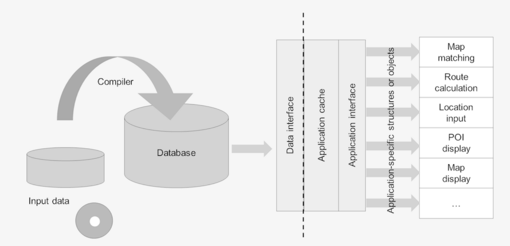
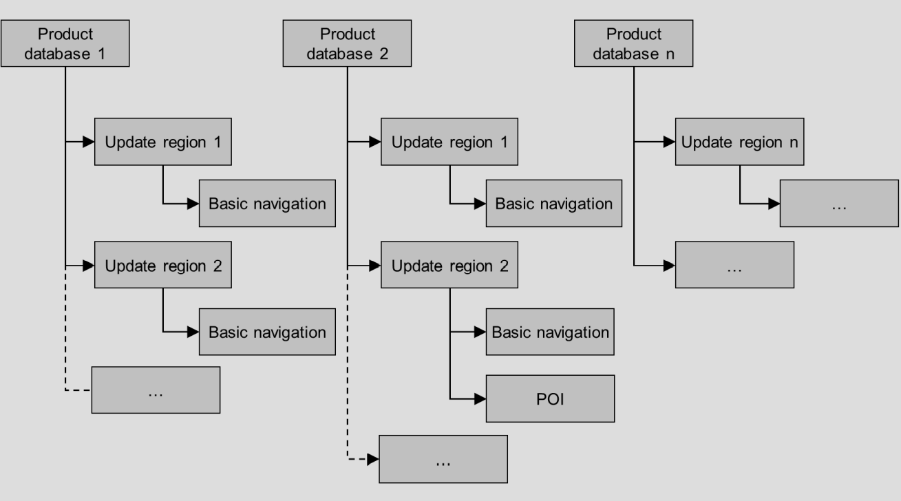

# *导航数据标准格式说明*

导航数据标准版本2.5.4-导航数据标准-物理存储格式

译者：hupan，于2022年09月，入职初

## **知识产权**

本说明文档由导航数据标准注册协会(e Navigation Data Standard e.V.)发布,以下简称NDS协会(NDS e.V.).它作为发展合作伙伴关系而发布,仅为了提供信息.NDS协会对本规范不承担任何法律责任.在导航数据格式物理存储格式说明开发的完成之后,商业开发许可将仅以书面许可协议形式提供给最终用户.

随着导航数据标准物理存储格式的发展,导航数据标准物理存储格式和相关的说明文档会发生变化且持续更新.NDS协会负责维护和解释导航数据标准物理存储格式.定义明确的发布标准的文档版本流程驱动了导航数据标准物理存储格式的发展.

未经NDS协会许可,文档的所有部分不得以任何理由和任何方式复制和使用,包括但不限于电子设备,器械,影印或缩印.

导航数据标准物理存储格式的书名文档可能包含示例(示范参考模型,"用例",和/或参考示范技术解决方案,设备,流程或软件).说明文档中所有这些示例仅为了说明问题,他们本身不是导航数据标准物理存储格式的一部分.无论是说明文档中出现的还是后续实际实现了这些示例规范标准的文档,都不意味着知识产权涵盖的相同示例适用于导航数据标准物理存储格式的相同标准.

导航数据标准物理存储格式在不断发展中.因此,文档中的描述可能会与实际实现相背离.如果是这种情况,DataScript的实际实现优先.

    Copyright © 2018 – Navigation Data Standard (NDS) e.V. All Rights Reserved.

    Document version 2.25 (based on NDS version 2.5.4, RDS version 4.6)

---

## **目录**

[1.关于文档](#1关于文档)

&ensp;&ensp;[1.1 目的和主题](#11目的和主题)

&ensp;&ensp;[1.2 目标受众](#12目标受众)

&ensp;&ensp;[1.3 NDS文档简介](#13nds文档简介)

&ensp;&ensp;[1.4 情态动词的使用](#14情态动词的使用)

&ensp;&ensp;[1.5 印刷约定](#15印刷约定)

[2.导航数据标准入门](#2导航数据标准入门)

[3.架构](#3架构)

&ensp;&ensp;[3.1 NDS数据库和它的接口](#31nds数据库和它的接口)

&ensp;&ensp;[3.2 NDS数据库结构](#32nds数据库结构)

&ensp;&ensp;&ensp;&ensp;[3.2.1 产品数据库](#321产品数据库)

&ensp;&ensp;&ensp;&ensp;[3.2.2 更新地区和更新地区集](#322更新地区和更新地区集)

[4.数据库结构](#4数据库结构)

5. 共享数据构块:更新区元数据
6. 属性
7. 地理数据分区
8. 加密
9. 可加载数据
10. 易失性数据构块
11. 路线构块
12. 路线:高级辅助驾驶(ADAS)
13. 路线:模拟通行费
14. 路线:eco路线
15. 路线:模拟道路
16. 道路构块
17. 名称构块
18. 基础地图显示构块
19. POI构块
20. 交通信息构块
21. NDS本地输入
22. SQLite本地输入构块
23. 全文搜索构块
24. 自动语音识别构块
25. 自然导航构块
26. 语音构块
27. 数字地形模型构块
28. 正交图构块
29. 三维对象构块
30. 地方标志构块
31. 障碍物构快
32. 交汇视图构块
33. 地图置信度构块
34. 图标
35. 术语表
36. NDS版本和相关数据模型版本
37. 警告标识

---

## **图清单**

[图4-1符合nds的数据库及其接口](#图4-1符合nds的数据库及其接口)

[图4-2产品数据库和更新区域概览](#图4-2产品数据库和更新区域概览)

---

## **表清单**

[表2-1情态动词使用规范](#表2-1情态动词使用规则)

---

## **1.关于文档**

本章概述了文档的历史、目的、主题和目标受众，紧接着是随后章节的概述。

### **1.1目的和主题**

文档包含了导航标准的物理存储格式——NDS的规范，这个格式已经被一个由制造商、系统供应商和地图供应商组成的协会——NDS协会所开发。这个文档描述了数据库的一般概念和格式。

NDS规范文档中的示例旨在让主题易于理解，它们不是必须遵守的。

### **1.2目标受众**

本文档为想要熟悉导航数据标准的IT专业人员提供。例如，可以是软件开发经理，汽车导航应用相关的产品经理或开发这类应用的软件工程师。

本文档默认假定读者掌握以下知识：

- 熟悉数字地图和导航系统
- 扎实的数据库结构和功能知识

### **1.3NDS文档简介**

以下是有关导航数据标准（NDS）的文档：

- NDS——物理模型描述：本文档包含了NDS数据脚本的实现，也包含了描述NDS数据类型的属性和结构的注释。
- NDS——格式规范：本文档详尽描述了NDS数据库的数据类型、特征含义和他们的属性，还有元数据。
- NDS——更新规范：本文档描述了更新NDS数据库的一般思路和流程。
- FTX文档：本文档描述了怎样用快速通道扩展来扩展NDS数据库。
- NDS——数据编译流程规范：本文档描述了按照NDS标准编译导航数据库的编译流程和编译要求。
- NDS——数据编译平台用户指南：本文档描述了按照NDS标准编译导航数据库所必须的工具和步骤。
- SQLite信息：SQLite参考引擎概述。
- RDS用户指南：RDS工具的开发者和用户手册。

### **1.4情态动词的使用**

为了符合NDS的标准，数据库供应商可能会区分强制要求、建议、许可、可能和功能。这是情态动词使用规则支持的符合NDS规范文档表达的四种规范：

###### **表2-1情态动词使用规则**

|规则|词|
|-|-|
|**要求**：为了符合标准要严格的遵守，不允许有偏差|shall/shall not|
|**推荐**：推荐是说在一系列的可能性中，被推荐的哪个是极其合适的，但不推荐也不排除其他可能性|should/should not|
|**许可**：许可表示NDS导出物的限制内允许的一系列行动|may/need not|
|**可能性和能力**：这些口头形式用于陈述可能性或能力，是技术的，物质的，物理的或其他的|can/cannot|
|**责任和必要**：这些口头形式用于描述NDS标准没有规定或强制执行的法律、组织或技术义务和必要条件|must/must not|

### **1.5印刷约定**

本文档使用以下排版约定：

- `代码元素`：此格式用于代码元素，例如类和属性的专业名词，还有属性的值。
- `文件和路径名称`：此格式用于文件和文件夹名，还有目录路径。
- *参考*：此格式用于对当前文档中的主题、作为导航数据标准一部分的其他规范中的主题或外部文档的交叉引用
- *术语*：此格式用于引入术语表，新术语和特别强调术语。
- <变量>：对于需要用实际值替换的站位符使用尖括号。例如：变量<安装路径>需要被替换，比如C:\Program Files。

本文档还使用下列提示的的字体：
|||
|-|-|
|**信息**|信息提示提供了背景知识，展示完成一项任务不同的方法或信息，让你更高校的完成你的工作|
|**注意**|注意提示提供了重要的信息帮助你规避错误和问题|
|**警告**|警告提示包含了必须遵循的特别信息，让你能避免失误，错误数据及其他主要问题|
|**举例**|包括了当前主题描绘概念的例子|

---

## **2.导航数据标准入门**

NDS协会是由汽车制造商、系统供应商和地图供应商的注册协会。该提议的目的是使汽车导航系统的物理存储格式标准化。

如今汽车导航系统的一个缺陷是每个导航系统都需要他们自己导航数据的存储格式。在不同导航系统之间直接交换数据是不可能的。

标准化的二进制格式既提供了新的功能也提供了新的机会。

该倡议的合作伙伴就NDS数据应该被满足的要求达成了一致。基于这些要求，下列目标被定义：

**兼容性和互通性**：
主要目标是兼容性和互通性，允许满足NDS标准的系统间交换导航数据。

**应用软件和数据的分离**：
如今的导航系统都是结合了应用软件和导航数据的。将软件和数据分离将创造系统的灵活性。

**更新**：
目前，汽车和移动终端的导航系统的更新媒介和更新机制繁杂。NDS提供了一个通用的数据库格式,整合了不同系统的更新概念。这确保了内容更新的灵活性，包括增量更新和部分更新。此外还可以不改变基础结构的情况下丰富数据库内容。

NDS支持的更新情景和更新机制在*NDS更新规范*里有介绍。

**未来目标**：除了上述列出的目标，还制定了以下目标：

- 世界范围内使用
- 格式紧凑高效
- 支持不同的发行版和工作媒介
- 预防非法使用

---

## **3.架构**

本章介绍依据NDS标准编译的数据库(因此亦称NDS数据库)的架构。解释了最重要的术语和使用中的关键概念。

### **3.1NDS数据库和它的接口**

导航系统供应商通常提供物理或逻辑上独立的数据集合，例如，道路，地图显示和语音输出，这些数据集合作为数据库。其他情况下，承载这些数据的某一数据实体集也被叫做数据库。

为了避免这种歧义，NDS定义数据库是给定时间内导航系统操作导航数据的总集。内容和结构是依照规范标准化的。标准化的目的是允许任何符合标准的应用可以用任意符合标准的数据库工作。

应用可以同时使用多个位置的数据库内容工作。例如，硬盘上的一个完整的数据库由闪存卡上补充附加的POI内容。这种情况，两个物理实体构成了一个逻辑数据库。

NDS数据库文件应该存储在按照[http://www.sqlite.org/fileformat2.html]描述的v3版本格式的SQLite数据库文件中，数据库应该使用UTF-8编码。

    注意：NDS协会提供了一个能够读取指定文件格式的SQLite引擎的参考实现。这个参考实现也处理压缩和多路复用，详见[第四章：数据库结构](#4数据库结构)的描述。

图4-1阐述了一个NDS环境下的导航系统。中间的虚线标记了完全符合当前格式规范中所描述的NDS的数据库与图中右边部分所描述的特定于应用程序的组件之间的边界。

###### **图4-1符合NDS的数据库及其接口**

编译数据从输入数据中创建符合标准的数据。编译的NDS兼容数据可以被不同的应用程序用于导航、地图显示或其他基于地图的服务。NDS支持的典型应用是车载或手持导航系统。

### **3.2NDS数据库结构**

一个NDS数据库可以由多个产品数据库组成，每个产品数据库可以进一步划分为更新区域。该概念支持NDS数据库灵活和统一版本的概念，并把不同数据供应商的数据库合并到NDS数据库变为了可能。符合NDS数据库的内部结构进一步表征为构建块、级别和自身内容。

**结构完整**

编译器必须确保生成的NDS数据库具有可靠的基本属性。这意味着，例如，所有的引用必须指向现有的特征，在更新之后也是。这也意味着必须以节省空间的方式编译NDS数据库。例如，如果一个空列表是一个可选成员而且可以省略的，那就不存储。

**一般处理流程**

13级是基础级别，包含道路和地图显示的全部详细信息。从输入数据创建的所有道路和BMD的特征都要精确地分配给13级的某一个tiles。

在之后的泛化过程中，特征可以简化或聚合分配给上级的tiles，或者直接忽略。

编译器执行的转换可以相互交织并高度相互依赖。为保证生成结果正确且使用生成的NDS数据库的应用表现合适，其中一些处理步骤遵循特定的顺序。如果本文档给出了一个步骤的顺序，那么这个序列就被认为是一个可行的假设，这意味着只要产生的结果与给定的处理序列相同，真正的编译器可能会偏离这个序列。

#### **3.2.1产品数据库**

每个产品数据库都由数据库供应商提交，它们有自己的版本控制因此能独立于其他产品数据库升级。产品数据库包含一个或多个构建块。产品数据库覆盖一个地理区域，可以更进一步的划分为多个升级区。

    举例：一个NDS数据库由以下两个产品数据库组成：

    * 哈曼国际组织的欧洲基础导航产品（包括基础地图显示，道路和名称构建块）

    * 米其林的欧洲POI产品

所有关于产品数据库的信息保存在产品数据库表里。

DataScript位置: nds.rootdb > ProductDbTable

#### **3.2.2更新地区和更新地区集**

**更新区域**

产品数据库的地理区域被划分为一个或多个更新区域。更新区域是产品数据库中可以局部更新的地理区域。区域更新可以增加或替换一整个更新区域。详情见*交换更新区域（取与更新）*。

更新区域的地理区域可以进一步分割为一系列的更新区域。

DataScript位置: nds.productdb > UpdateRegionTable

图 4-2: Overview of products and update regions
###### **图4-2产品数据库和更新区域概览**

产品数据库的两个或多个相邻更新区域可能在边界的定义点(所谓的通道)上重叠。它们的内部是不连贯的。更新区域可能包含空洞和不连接的区域，例如飞地和飞地。请参见*更新区域之间的通道*

NDS没有定义更新区域的具体地理范围。范围由地图供应商、系统供应商或汽车制造商定义的地图数据库产品的需求决定。

每个更新区域都有一个惟一的更新区域ID，该ID在对应的基线地图的生命周期内保持不变。更新区域ID由NDS数据库供应商定义和维护。

这意味着所有更新区域的id都在编译时分配，并且这些id保持不变。后续通过地图扩展添加的更新区域id不应违反唯一性约束。

NDS更新规范提供了更新区域的详细概念描述，并详细描述了符合NDS的数据库的版本控制概念。

**更新区域集**

---

## **4.数据库结构**

